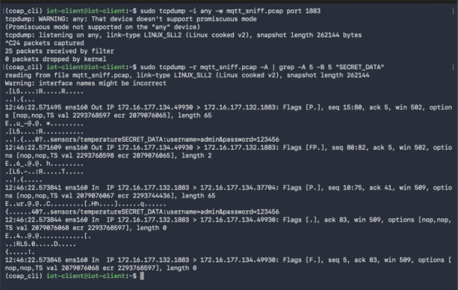

# Bezpieczeństwo protokołów IoT (MQTT/CoAP)

## Opis projektu
Projekt badawczo-wdrożeniowy dedykowany analizie podatności, testom penetracyjnym oraz implementacji zaawansowanych mechanizmów zabezpieczających w najpopularniejszych protokołach komunikacyjnych internetu rzeczy – **MQTT (Message Queuing Telemetry Transport)** oraz **CoAP (Constrained Application Protocol)**. 

W ramach projektu zbudowano dedykowane środowisko laboratoryjne, przeprowadzono pasywny podsłuch sieciowy (sniffing) niezaszyfrowanych pakietów, a następnie zaimplementowano warstwowe mechanizmy obronne: szyfrowanie transmisji (TLS/DTLS) oraz kontrolę dostępu (ACL).

Projekt zrealizowany w ramach przedmiotu *Projektowanie systemów bezpieczeństwa* na Politechnice Rzeszowskiej (Kierunek: Inżynieria i Analiza Danych).

## Technologie i narzędzia
* **Protokoły IoT:** MQTT (Broker Mosquitto), CoAP (Eclipse Californium / Copper)
* **Cyberbezpieczeństwo:** TLS (Transport Layer Security), DTLS (Datagram TLS), certyfikaty X.509
* **Analiza sieciowa:** Wireshark, tshark
* **Kontrola dostępu:** Listy ACL (Access Control Lists), autoryzacja login/password

---

## 🔬 Architektura środowiska i analiza podatności

W etapie podstawowym zweryfikowano domyślne konfiguracje protokołów. Testy wykazały krytyczną podatność na przechwytywanie danych w strukturze jawnego tekstu (plain text).

### Architektura połączeń brokera MQTT
Komunikacja została ustrukturyzowana wokół scentralizowanego brokera, który pośredniczy w wymianie ramek telemetrycznych pomiędzy klientami publikującymi (Publishers) a subskrybującymi (Subscribers) określone tematy (topics):

<kbd>
  
</kbd>

### Podsłuch niezaszyfrowanego ruchu (Sniffing)
Wykorzystując analizator narzędziowy Wireshark, przechwycono pakiety transmisyjne na standardowym porcie. Payload oraz wrażliwe dane sterujące (w tym loginy i hasła) były w pełni czytelne dla pasywnego obserwatora w sieci:

<kbd>
  
</kbd>

---

##  Wdrożenie mechanizmów obronnych (Hardening)

W celu eliminacji ryzyk i utwardzenia infrastruktury sieciowej IoT zaimplementowano warstwowe podejście do bezpieczeństwa.

### 1. Szyfrowanie transmisji (TLS/DTLS)
Wygenerowano strukturę urzędu certyfikacji (CA) oraz klucze kryptograficzne. Ruch sieciowy został zabezpieczony za pomocą TLS (dla TCP/MQTT) oraz DTLS (dla UDP/CoAP). Ponowna analiza ruchu w Wiresharku potwierdziła, że payload stał się całkowicie zaszyfrowany i nieczytelny:

<kbd>
  
</kbd>

### 2. Autoryzacja i listy kontroli dostępu (ACL)
Wdrożono rygorystyczną politykę uwierzytelniania użytkowników. Broker Mosquitto został skonfigurowany do odrzucania połączeń anonimowych, a dedykowane pliki ACL zdefiniowały precyzyjne mapy uprawnień (read/write) do konkretnych gałęzi tematów.

Logi serwera potwierdzające wymuszenie autoryzacji oraz bezpieczne ustanawianie połączeń szyfrowanych:
<kbd>
  
</kbd>

---

---

* **Magdalena Stanek**
* Opiekun projektu: dr inż. Mariusz Nycz
* *Politechnika Rzeszowska, 2025*
